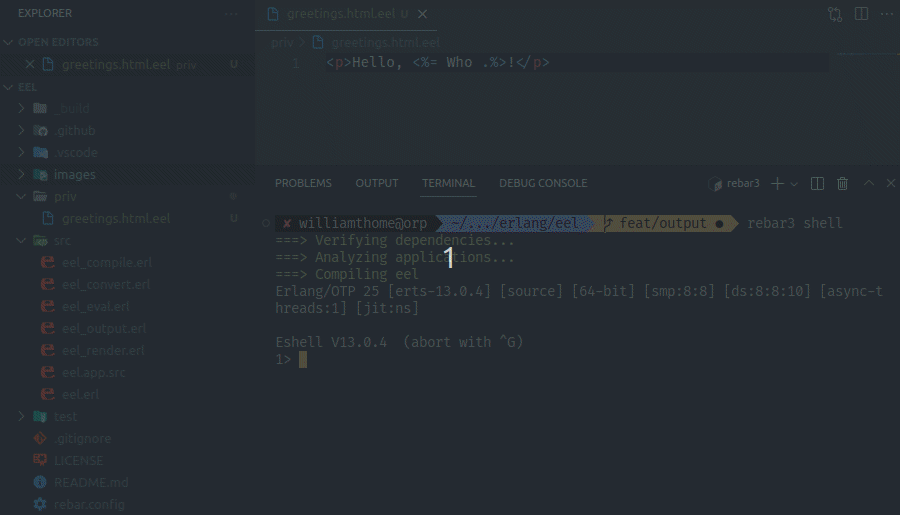

# Embedded Erlang (EEl)

Much like Elixir has EEx, Erlang has EEl, or Embedded Erlang. With EEl we can embed and evaluate Erlang inside binaries.

## API

The EEl supports compiling to [AST](https://www.erlang.org/doc/apps/erts/absform.html) and evaluating binaries directly.

### Compiling

The compiler module supports binaries and files. The return is a tuple with static, ASTs and variables.
- Static are a list of binaries that never changes;
- ASTs are a list of Erlang Abstract Syntax Tree;
- Variables are a list of atoms of unbound variables. These variables are required in the bindings parameter of the render function.

### Rendering

The renderer module evaluates the compiler return into a tuple with a binary, memorizing data and a map with the indexes of the assigned bindings.
- The binary is the rendering result;
- Memorizing data it's a metadata to be reused in the next render. This helps the renderer to only update the new changes;
- The map with indexes indicates the index of the bindings.

### Evaluating

The evaluator module evaluates a binary.

```console
1> eel:eval(<<"Hello, <%= Name .%>!">>, #{'Name' => <<"World">>}).
<<"Hello, World!">>
```

### Outputing

A template or a binary can be output to a module.



## Syntax

The Erlang code it's written between section punctuations. These section punctuations are:
- `<%=` starts an expression;
- `.%>` indicates that the expression ends;
- `%>` indicates that the expression continues;
- `<%` continues the last expression if it ends with `%>`;
- `<%%` starts a comment;
- `%%>` ends a comment.

The bindings are the unbound/required variables of the template. The syntax it's a map with keys as atoms starting with upper case, e.g:

```erlang
#{'Foo' => <<"foo">>, 'Bar' => bar}
```

The `erl_eval` expects this syntax.

### Template

The template should have the `.html.eel` extension and a structure like this:


### Highlight

If you use VSCode, there is an [Embedded Erlang (EEl)](https://marketplace.visualstudio.com/items?itemName=williamthome.eel) extension in the Marketplace.

## Next steps

- Improve docs
- Improve code
- Generic engine like [EEx](https://hexdocs.pm/eex/EEx.Engine.html)
- Handle errors
- Editor extensions

## Sponsors

If you like this tool, please consider [sponsoring me](https://github.com/sponsors/williamthome).\
I'm thankful for your never-ending support :heart:

I also accept coffees :coffee:

[](https://www.buymeacoffee.com/williamthome)

## Contributing

### Issues

Feels free to [submit an issue on Github](https://github.com/williamthome/eel/issues/new).

### Installation

```console
# Clone this repo
git clone git@github.com:williamthome/eel.git

# Navigate to eel project root
cd eel

# Fetch dependencies (ensure you have rebar3 installed)
# Note: fetches the erlfmt plugin only
rebar3 deps
```

### Running locally

#### Compile

    $ rebar3 compile

#### Shell

    $ rebar3 shell

#### Test

    $ rebar3 eunit

#### Format

    $ rebar3 fmt
