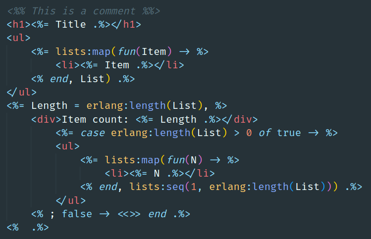

# EEl

Much like Elixir has EEx, Erlang has EEl, or Embedded Erlang. With EEl we can embed and evaluate Erlang inside binaries.

## API

### Evaluation

```erlang
1> eel:eval(<<"Hello, <%= Who .%>!">>, #{'Who' => <<"World">>}).
<<"Hello, World!">>
```

## Example

Given this module

```erlang
-module(foo).

-export([render/1, render/2]).

render(Bindings) ->
    {ok, Snapshot} = eel:compile(<<
        "<html>"
        "<head>"
            "<title><%= Title .%></title>"
        "</head>"
        "<body>"
            "Hello, <%= Who .%>!"
        "</body>"
        "</html>"
    >>),
    render(Bindings, Snapshot).

render(Bindings, Snapshot) ->
    {ok, RenderSnapshot} = eel_renderer:render(Bindings, Snapshot),
    {eel_evaluator:eval(RenderSnapshot), RenderSnapshot}.
```

now run

```shell
rebar3 shell
```

and type this in the Erlang shell

```erlang
1> {_, Snapshot} = foo:render(#{title => <<"Hey!">>, who => <<"World">>}).
{<<"<html><head><title>Hey!</title></head><body>Hello, World!</body></html>">>,
 #{ast =>
       [[{call,1,
               {remote,1,{atom,1,eel_converter},{atom,1,to_binary}},
               [{'fun',1,{clauses,[{clause,1,[],[],[{var,1,'Title'}]}]}}]}],
        [{call,1,
               {remote,1,{atom,1,eel_converter},{atom,1,to_binary}},
               [{'fun',1,{clauses,[{clause,1,[],[],[{var,1,'Who'}]}]}}]}]],
   bindings => #{'Title' => <<"Hey!">>,'Who' => <<"World">>},
   changes => [{1,<<"Hey!">>},{2,<<"World">>}],
   dynamic => [<<"Hey!">>,<<"World">>],
   static =>
       [<<"<html><head><title>">>,
        <<"</title></head><body>Hello, ">>,<<"!</body></html>">>],
   vars => [{1,['Title']},{2,['Who']}]}}
2> {Bin, _} = foo:render(#{who => <<"Erlang">>}, Snapshot).
{<<"<html><head><title>Hey!</title></head><body>Hello, Erlang!</body></html>">>,
 #{ast =>
       [[{call,1,
               {remote,1,{atom,1,eel_converter},{atom,1,to_binary}},
               [{'fun',1,{clauses,[{clause,1,[],[],[{var,1,'Title'}]}]}}]}],
        [{call,1,
               {remote,1,{atom,1,eel_converter},{atom,1,to_binary}},
               [{'fun',1,{clauses,[{clause,1,[],[],[{var,1,'Who'}]}]}}]}]],
   bindings => #{'Title' => <<"Hey!">>,'Who' => <<"Erlang">>},
   changes => [{2,<<"Erlang">>}],
   dynamic => [<<"Hey!">>,<<"Erlang">>],
   static =>
       [<<"<html><head><title>">>,
        <<"</title></head><body>Hello, ">>,<<"!</body></html>">>],
   vars => [{1,['Title']},{2,['Who']}]}}
```

Looking at the pattern matched results, the first tuple element contains the evaluated value
```erlang
<<"<html><head><title>Hey!</title></head><body>Hello, World!</body></html>">>
```
and the second a metadata called `snapshot` (see next)
```erlang
#{ast =>
       [[{call,1,
               {remote,1,{atom,1,eel_converter},{atom,1,to_binary}},
               [{'fun',1,{clauses,[{clause,1,[],[],[{var,1,'Title'}]}]}}]}],
        [{call,1,
               {remote,1,{atom,1,eel_converter},{atom,1,to_binary}},
               [{'fun',1,{clauses,[{clause,1,[],[],[{var,1,'Who'}]}]}}]}]],
   bindings => #{'Title' => <<"Hey!">>,'Who' => <<"World">>},
   changes => [{1,<<"Hey!">>},{2,<<"World">>}],
   dynamic => [<<"Hey!">>,<<"World">>],
   static =>
       [<<"<html><head><title>">>,
        <<"</title></head><body>Hello, ">>,<<"!</body></html>">>],
   vars => [{1,['Title']},{2,['Who']}]}
```

The line `1` will evaluate the bindings `title` and `who`, but the line `2`
will only eval the `who` variable, because it uses the snapshot of the previous
render. It only eval the changes and does not need to compile the binary again, unless the expression contains the global `Bindings` variable (see below),
because the `snapshot` includes the required information.

The global `Bindings` variable can be used to get values in a conditional way, checking if the variable exists in the template, e.g.:

```
<%= maps:get(foo, Bindings, bar) .%>
```

Including `Bindings` to the expression makes it to be always evaluated by the render function.


Including the header

```erlang
-include("eel.hrl").
```

will transform the `eel:compile` to AST by evaluating it in te compile time, boosting the performance.

## Syntax

The Erlang code it's written between section punctuations called `markers`:
- `<%=` starts an expression;
- `.%>` indicates that the expression ends;
- `%>`  indicates that the expression continues;
- `<%`  continues the last expression if it ends with `%>`;
- `<%%` starts a comment;
- `%%>` ends a comment.

The bindings are the unbound/required variables of the template. The syntax it's a map with keys as atoms starting with upper case, e.g:

```erlang
#{'Foo' => <<"foo">>, 'FooBar' => bar}
```

or the same in lower case (note the snake case in foo_bar):

```erlang
#{foo => <<"foo">>, foo_bar => bar}
```

Both lower and upper case are valid syntax for bindings.

## Engine

The default engine is the `eel_smart_engine`.\
You can implement your own engine using the behavior `eel_engine`.

## Template

The template should have the `.eel` extension and a structure like this:



## Highlight

If you use VSCode, you can get highlighting by installing the [Embedded Erlang (EEl)](https://github.com/williamthome/vscode_eel) extension.

## Sponsors

If you like this tool, please consider [sponsoring me](https://github.com/sponsors/williamthome).\
I'm thankful for your never-ending support :heart:

I also accept coffees :coffee:

[](https://www.buymeacoffee.com/williamthome)

## Contributing

### Issues

Feels free to [submit an issue on Github](https://github.com/williamthome/eel/issues/new).

### Installation

```shell
# Clone this repo
git clone git@github.com:williamthome/eel.git

# Navigate to the project root
cd eel

# Compile (ensure you have rebar3 installed)
rebar3 compile
```
